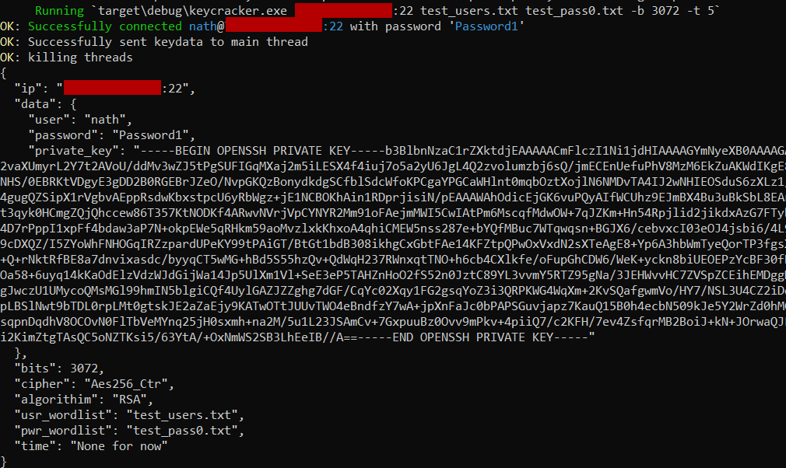

# KeyCracker

Key cracker is a key based authentication brute force tool that was written over a weekend in Rust.
Though a lot of this project has been completed, there are still some features I would like to implement such as offline private/public key brute forcing and logging capabilities.

As I hve other commits else where, this project and my other projects on github only when receive love when I have the time.
This project was originally written to help me on my bug bounty hunting to demonstrate how older versions of openssh that are vulnerable to username enumeration can be exploited even when the only authentication option is performed via a public and private key.

This tool works just like any other SSH brute forcing tool, except that it can generate private keys based on a word list. This tool is espcially useful in situations where you the user does have access to the public or private key.

## Features
KeyCracker has the following features
- Brute force users and passwords via wordlists
- Generate private keys on the fly via a password list
- Mutlithreading
- Supports all platforms
- Supports the following key algorithims:
  - Rsa, 
  - Dsa, 
  - Ecdsa, 
  - Ed25519,
- Supports the following ciphers:
  - AES 128 CBC/CTR
  - AES 192 CBC/CTR
  - AES 256 CBC/CTR

## Installation Requirements
1. Download and install rustup https://www.rust-lang.org/
2. Add the cargo to your path
3. cd into the project directory
4. Run the following command
`Cargo build --release`
5. You will find the executable under /target/build/

### OpenSSL
This projects are valid install of openSSL

#### Linux
On linux this should be installed by default, however if not openSSL can be instaled with `sudo apt-get install openssl`

#### Windows
Read the following guide [here](https://thesecmaster.com/procedure-to-install-openssl-on-the-windows-platform/)
You will need to add the openssl installation directory to your PATH environment variable.
You will also need to create environment variable that points to the openssl configuration file like the following `OPENSSL_CONF=C:\Program Files\OpenSSL-Win64\bin\openssl.cfg`